本文档简要介绍Hyper-V的安装过程，CEVA虚拟机配置过程以及CEVA
Toolbox的License导入教程。

# 一、Hyper-V简要介绍

Hyper-V是微软开发的基于硬件的虚拟机管理程序，它允许用户在Windows操作系统之上运行不同操作系统的多个实例。目前，Hyper-V也支持Windows、Ubuntu和其他Linux发行版。由于该工具是由微软自己开发的，与其他第三方工具相比，通过Hyper-V运行
Windows VM时的性能会更好一些。

在定制方面，Hyper-V不像其他虚拟机管理程序那样功能丰富，但速度很快。原因是大多数驱动程序独立于硬件层运行，从而减少了维护虚拟机的开销。

# 二、Hyper-V安装教程

Hyper-V在Windows
11专业版中可以直接使用，故不需要运行脚本来安装Hyper-V。Hyper-V在Windows
11家庭版中不可用，故需要运行脚本来安装Hyper-V。请根据自己的Windows版本选择是否需要安装Hyper-V。

2.1 打开控制面板，选择"程序"。

{width="4.30625in"
height="2.0145833333333334in"}

2.2 点击"程序与功能"中的"启用或关闭Windows功能"选项。

{width="4.408905293088364in"
height="1.5223884514435695in"}

2.3
弹出"启用或关闭Windows功能"界面，寻找是否有名叫Hyper-V的文件夹，没有则按步骤继续进行，安装Hyper-V；有的话则跳到步骤2.11。

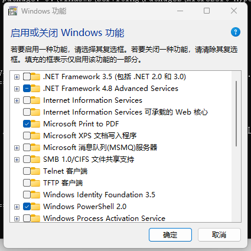{width="3.155844269466317in"
height="3.155844269466317in"}

2.4 新建记事本，将以下内容存入。

pushd \"%\~dp0\"

dir /b %SystemRoot%\\servicing\\Packages\\\*Hyper-V\*.mum \>hyper-v.txt

for /f %%i in (\'findstr /i . hyper-v.txt 2\^\>nul\') do dism /online
/norestart /add-package:\"%SystemRoot%\\servicing\\Packages\\%%i\"

del hyper-v.txt

Dism /online /enable-feature /featurename:Microsoft-Hyper-V -All
/LimitAccess /ALL

pause

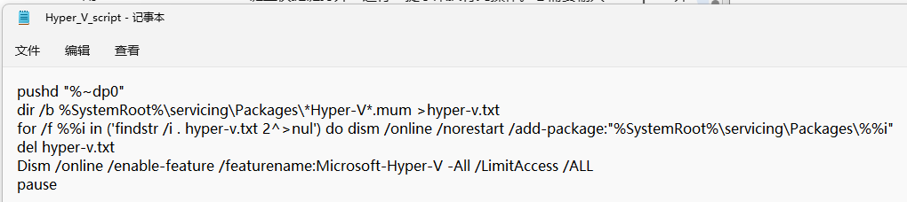{width="5.768055555555556in"
height="1.288888888888889in"}

2.5 点击记事本"文件"中的"另存为"选项。

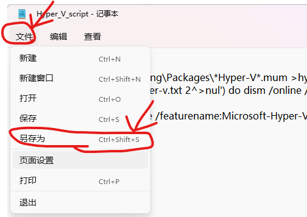{width="3.9988068678915134in"
height="2.8245538057742783in"}

2.6
选择文件保存的位置，选择保存类型为"所有文件"，在文件名后面增加".bat"后缀，然后点击保存。

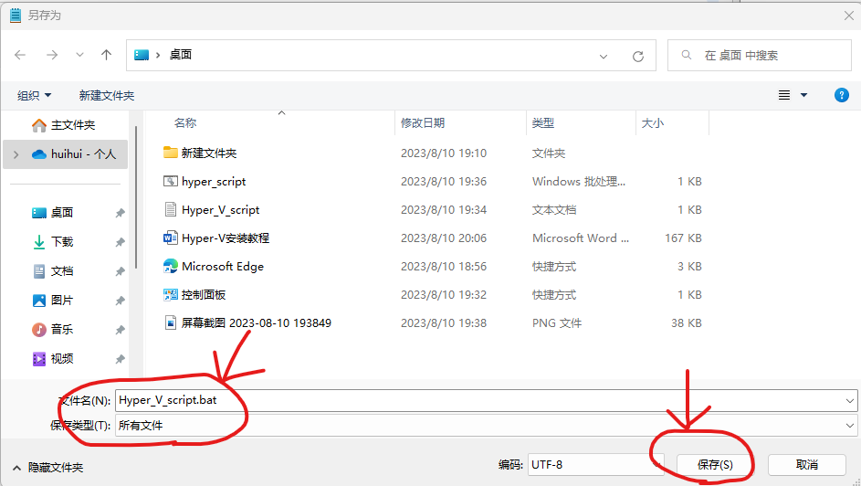{width="4.778821084864392in"
height="2.696069553805774in"}

2.7 找到记事本保存的".bat"文件，右击选择"以管理员身份运行"运行文件。

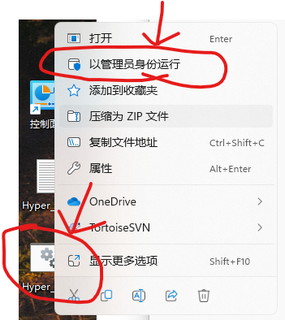{width="2.314010279965004in"
height="2.597492344706912in"}

2.8 完成操作后，它将打开命令提示符/PowerShell窗口并开始在 Windows
11家庭版上安装
Hyper-V。注意需要连接到互联网才能启用此功能。如果CMD窗口卡住，请按"Enter"键。Hyper-V安装完成后，重新启动Windows
11计算机。

{width="4.226388888888889in"
height="2.448008530183727in"}

2.9 打开控制面板，选择"程序"。

{width="5.4847222222222225in"
height="2.234722222222222in"}

2.10 点击"程序与功能"中的"启用或关闭Windows功能"选项。

{width="4.320895669291339in"
height="1.937587489063867in"}

2.11
弹出"启用或关闭Windows功能"界面，向下滚动并启用"Hyper-V"、"虚拟机平台"和"Windows虚拟机监控程序平台"。

{width="2.4701498250218723in"
height="3.6897845581802273in"}

2.12
最后点击确定按钮，它将开始安装必要的软件包，并在安装完成后重新启动计算机。

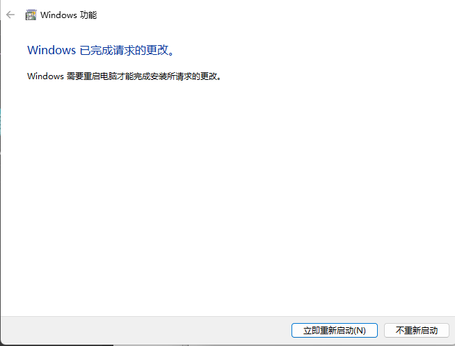{width="4.465296369203849in"
height="3.400313867016623in"}

2.13
重启完成后，按windows键，搜索"Hyper-V"，点击Hyper-V管理器进行Hyper-V虚拟机界面。至此Hyper-V虚拟机安装完成。

{width="4.617561242344707in"
height="2.395521653543307in"}

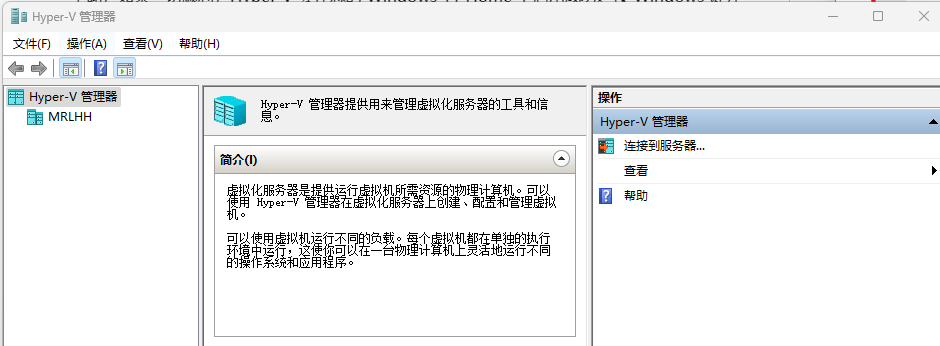{width="5.768055555555556in"
height="2.122916666666667in"}

# 三、CEVA虚拟机配置教程

项目使用的CEVA开发环境需要license，故安装CEVA虚拟机并在上面配置license，（之后电脑本地CEVA开发环境会自动认证license【不一定会自动认证】，使用者不需要关注license，而直接使用开发环境）。下面介绍CEVA虚拟机的配置流程。

3.1 打开Hyper-V虚拟机，选中"虚拟交换机管理器"选项。

{width="5.805071084864392in"
height="3.476307961504812in"}

3.2
选择"虚拟交换机"栏目的"创建虚拟网络交换机"，然后点击"内部"选项，再点击"创建虚拟交换机"。

{width="5.519051837270341in"
height="3.906337489063867in"}

3.3 在弹出的界面中修改名称，随意，这里修改成CEVA，然后点"确定"。

{width="4.332158792650919in"
height="4.1569116360454945in"}

3.4 选择"创建"选项，然后创建"虚拟机"。

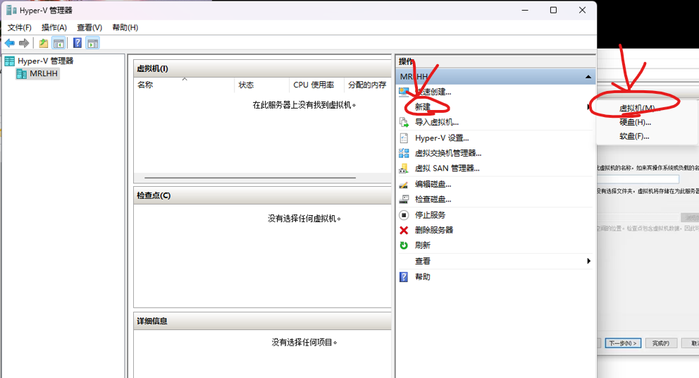{width="5.768055555555556in"
height="3.1166666666666667in"}

3.5 弹出"创建虚拟机向导"界面，直接点击"下一页"选项。

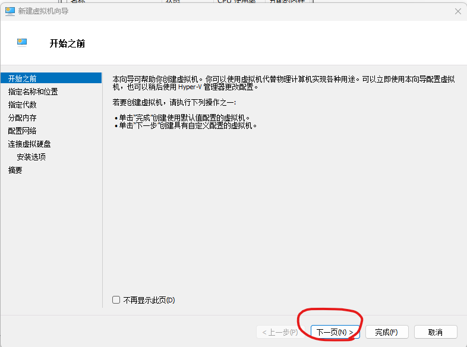{width="5.768055555555556in"
height="4.286111111111111in"}

3.6
修改名称以及更改存储位置（该位置需要空出至少40G左右的内存空间来存储CEVA硬盘映像文件）。点击"下一页"选项。

{width="5.768055555555556in"
height="4.304166666666666in"}

3.7 选择虚拟机的代数为"第二代"，然后点击"下一页"选项。

{width="5.768055555555556in"
height="4.370833333333334in"}

3.8 选择启动内存为"4096"MB，然后点击"下一页"选项。

{width="5.478758748906387in"
height="4.084992344706912in"}

3.9 选择连接到刚才新建的虚拟交换机管理器"CEVA"，然后点击"下一页"选项。

{width="5.343478783902012in"
height="4.189891732283464in"}

3.10
选择"使用现有虚拟硬盘"，然后浏览并选择CEVA硬盘映像文件CEVA.vhdx的位置，然后点击"下一页"选项。

{width="5.517391732283465in"
height="4.306759623797025in"}

3.11 点击"完成"，等待系统加载完成。

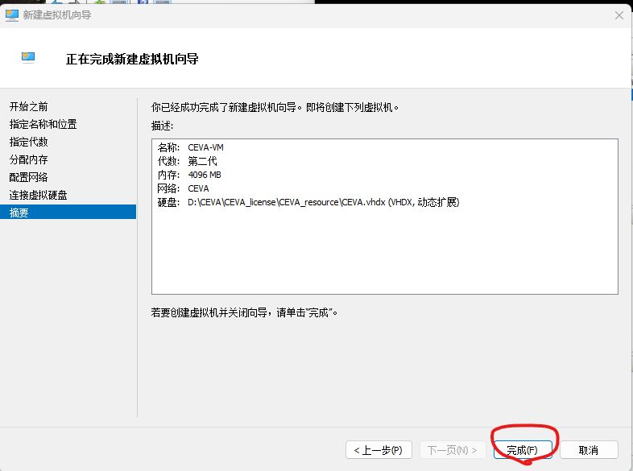{width="5.674204943132109in"
height="4.22320428696413in"}

3.12 选中刚才创建好的虚拟机"CEVA-VM"，右击选中"设置"选项。

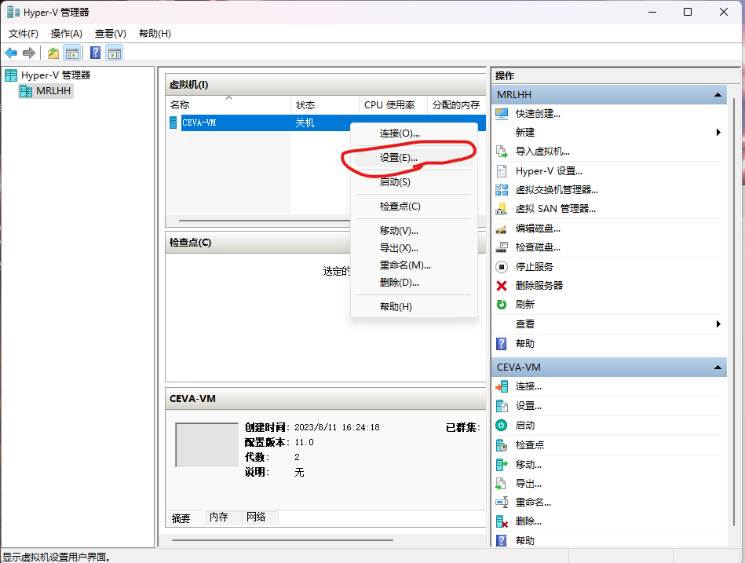{width="5.768055555555556in"
height="4.358333333333333in"}

3.13
在弹出的界面中，选择"网络适配器"选项的"高级功能"，然后选择静态路由，将路由改为80
E8 2C F8 6B 48，然后点击"确定"。

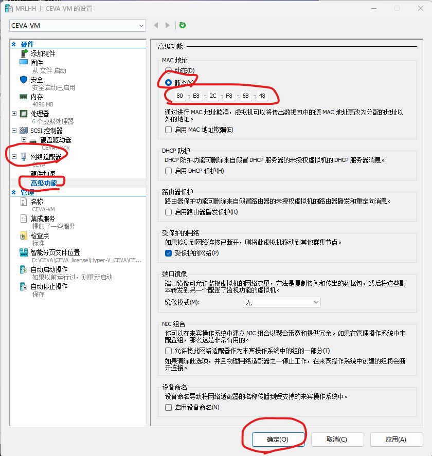{width="5.219817366579178in"
height="5.5120417760279965in"}

3.14
选中虚拟机"CEVA-VM"，右击选中"连接"选项。在弹出的"虚拟机连接"界面中，点击"启动"，然后等待系统加载完成。

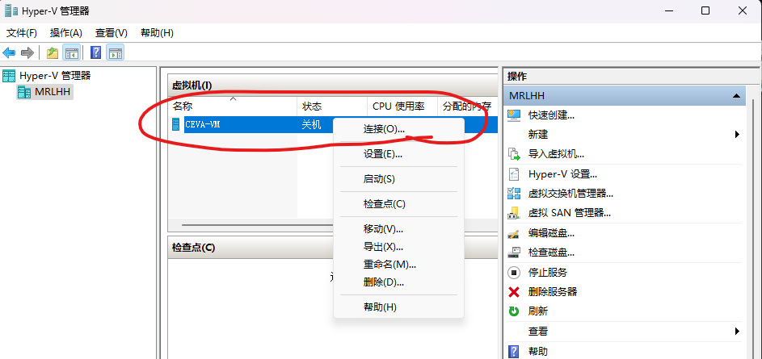{width="5.541765091863517in"
height="2.614757217847769in"}

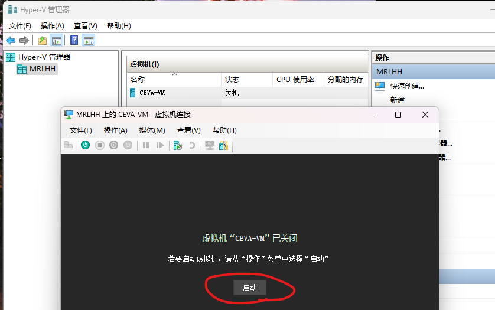{width="4.466139545056868in"
height="2.7981922572178477in"}

3.15 在弹出的"连接到CEVA-VM"界面中，选择默认配置，点击"连接"，等待加载。

{width="3.7761439195100612in"
height="2.092187226596675in"}

3.16 加载出用户登录界面，输入密码：seu.6636。

{width="5.3997736220472445in"
height="3.4429582239720036in"}

3.17
将本地电脑上的文件LIC-4210-4500-1643-20230612.lic文件复制到虚拟机电脑界面中，记住文件在虚拟机电脑界面中的位置，这里保存到C:/license中。注意直接在本地电脑上直接把文档拖到虚拟机中是无法执行的，这里需要在本地电脑上先右击"复制"，然后在虚拟机界面中右击"粘贴"。

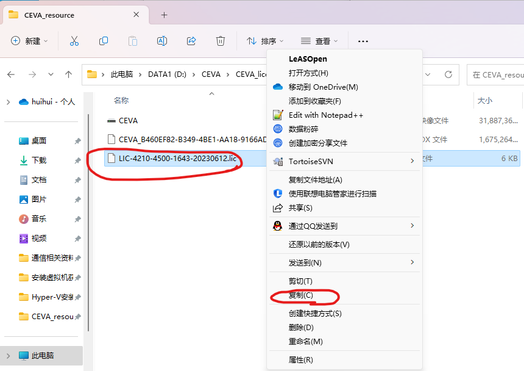{width="4.258510498687664in"
height="2.50661198600175in"}

{width="4.39498687664042in"
height="1.8880599300087488in"}

3.18 点击虚拟机桌面下面的文件夹图标，然后点击"本地磁盘(C)"。

{width="5.138928258967629in"
height="3.318093832020997in"}

3.19
选择本地磁盘C下的CEVATB---\>V17---\>XC---\>license文件夹，点击"Imtools.exe"程序。

{width="5.324896106736658in"
height="2.806096894138233in"}

3.20 在弹出的界面中，选择"Config Service"一栏，选择将"Path to the
license file"选项修改为刚才复制的文件的位置，然后点击"Save Service"。

{width="5.768055555555556in"
height="2.51875in"}

3.21 打开CEVA-XC ToolBox
V17软件，如果编译成功则说明license安装成功，如果失败则继续步骤3.22。

3.22 在弹出的界面中，选择"Start/Stop/Reread"一栏，先选择"Stop
Server"，等最下面一行提示Stop成功后再点击"ReRead License
File"，出现提示ReRead成功后再点击"Start
Server"，等待提示Start成功。将"Path to the license
file"选项修改为刚才复制的文件的位置。注意以上顺序不固定，但是最终要显示Start成功。

{width="5.244344925634295in"
height="3.3552176290463693in"}

3.23
情况说明：配置好license之后就不需要打开虚拟机了，因为会在后台默认正常工作。如果突然出现验证license，可能是imtools.exe的界面被关掉了，重新打开和完成初始化进行了

# 四、CEVA Toolbox的License加载教程

4.1 在安装完成CEVA
Toolbox软件后，需要提供license才能进行正常编译和运行。在Toolbox中点击编译按键后会弹出提示框。

{width="4.582089895013123in"
height="2.891988188976378in"}

4.2 在弹出的提示框中，选择第一个选项"Specify the License Server
System"后，输入"27000@temphostname"进行license载入，编译成功！。

注意：若多次尝试后还是编译失败，需要进入虚拟机中重新加载license**。**
