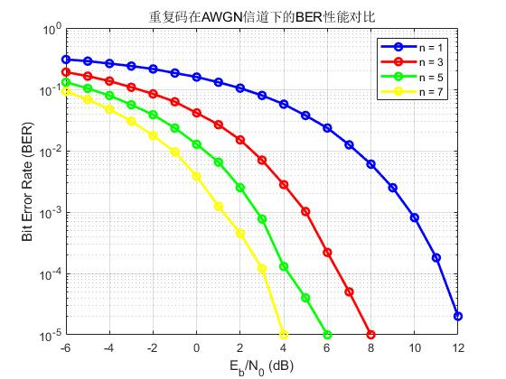

## 一、信道编码基础概述

### 1. 信道编码目的

**信道编码**（Channel Coding）是一种在数据传输前对信息进行冗余编码的技术，**用于提高通信系统在信道干扰、噪声等条件下的抗误码能力。**

其核心思想是：

**在原始信息中添加冗余信息，使得接收端可以检测甚至纠正在传输过程中产生的错误。**

### 2. 编码率定义

信道编码引入了“冗余比特”，其编码效率通常由**编码率（Code Rate）R**来衡量：

$$
R=\frac{K}{N}
$$

- 𝐾 信息比特数（原始数据）

- 𝑁 编码后比特数（含冗余）

- 𝑅∈(0,1]：值越大，说明冗余越少，效率越高

### 3. 本文介绍的编码

| 编码类型         | 特点说明        |
| ------------ | ----------- |
| 重复码          | 简单，每比特重复多次  |
| 奇偶校验码        | 仅能检测偶数/奇数错误 |
| 汉明码          | 可纠1位、检2位错   |
| 卷积码          | 实时编码，结构灵活   |

## 二、重复码

### 1. 基本原理

重复码是一种最简单的信道编码方式，其思想是：

**将每个信息比特重复多次发送，从而增加抗干扰能力。**

例如，若原始比特为：

```matlab
1 0 1
```

设定重复次数 n=3，编码后为：

```matlab
1 1 1  0 0 0  1 1 1
```

重复码能有效对抗噪声，但效率较低，属于典型的冗余换可靠性策略。

### 2. MATLAB 示例：重复编码流程

```matlab
% 1. 原始比特
num_bits = 3;
msg = randi([0 1], 1, num_bits);
fprintf('原始数据：        %s\n', num2str(msg));

% 2. 重复编码（每比特重复n次）
n = 3;
coded_bits = repelem(msg, n);
fprintf('重复编码后数据：   %s\n', num2str(coded_bits));
```

**示例输出：**

```matlab
原始数据：        1 0 1
重复编码后数据：   1 1 1 0 0 0 1 1 1
```

### 3. 重复码的BER性能仿真

在 BPSK + AWGN 信道下，使用多数表决方式解码。即将接收到的多个重复位进行加权求和，若和为正，则判为1，否则判为0。

```matlab
% 参数设置
n = 2; % 重复次数
num_bits = 10000;
EbN0_dB = -10:1:10;
ber = zeros(size(EbN0_dB));

for idx = 1:length(EbN0_dB)
    % 1. 原始比特
    msg = randi([0 1], 1, num_bits);

    % 2. 重复编码
    coded_bits = repelem(msg, n);

    % 3. BPSK调制
    tx_symbols = 2 * coded_bits - 1;

    % 4. AWGN信道
    EbN0 = 10^(EbN0_dB(idx)/10);
    noise_var = 1/(2*EbN0);
    noise = sqrt(noise_var) * randn(size(tx_symbols));
    rx_symbols = tx_symbols + noise;

    % 5. 多数表决解码
    rx_matrix = reshape(rx_symbols, n, []);
    symbol_sum = sum(rx_matrix);
    decoded_bits = symbol_sum > 0;

    % 6. 计算BER
    [~, ber(idx)] = biterr(msg, decoded_bits);
end

% 7. 绘图
figure;
semilogy(EbN0_dB, ber, '-o', 'LineWidth', 2);
grid on;
xlabel('E_b/N_0 (dB)');
ylabel('Bit Error Rate (BER)');
title(sprintf('重复码 (n = %d) 在AWGN信道下的BER性能', n));
```

以下给出仿真曲线：


下图给出重复码在不同重复次数下曲线：



## 三、奇偶校验码（Parity Check Code）

### 1. 基本原理

奇偶校验码是一种简单的错误检测码，通过在数据后添加一个校验位（parity bit）来判断数据在传输中是否出错。

- **奇校验（odd parity）**： 校验后整个码字的“1”的个数为奇数；

- **偶校验（even parity）**： 校验后整个码字的“1”的个数为偶数；

该方法只能检测**奇数个错误**，不能纠正错误，也无法检测偶数位同时出错的情况。

### 2. MATLAB 示例：奇校验编码与检测

```matlab
clc; clear;

% 原始数据（8位）
data = [1 0 0 1 0 1 1 0 0];

% 1. 编码：添加奇校验位
if mod(sum(data), 2) == 0
    parity_bit = 1;  % 原本是偶数，补1变成奇数
else
    parity_bit = 0;  % 原本是奇数，补0保持奇数
end

tx = [data parity_bit];         % 添加校验位，构成传输比特流

fprintf('原始数据：        %s\n', num2str(data));
fprintf('添加奇校验位后：  %s\n', num2str(tx));

%% 2. 模拟传输过程中的错误（控制错误位置）

% 情况A：传输中没有错误
rx1 = tx;

% 情况B：单比特错误（改变第5位）
rx2 = tx; rx2(3) = mod(rx2(3)+1, 2);

% 情况C：双比特错误（改变第1和3位）
rx3 = tx; rx3([1 3]) = mod(rx3([1 3])+1, 2);

%% 3. 检测函数
detect_parity_error = @(vec) mod(sum(vec), 2) == 1;

%% 4. 判定并输出
fprintf('\n情况A：无错误      %s → %s\n', num2str(rx1), ...
    ternary(detect_parity_error(rx1), '无错', '检测到错误'));

fprintf('情况B：1位错误      %s → %s\n', num2str(rx2), ...
    ternary(detect_parity_error(rx2), '无错', '检测到错误'));

fprintf('情况C：2位错误      %s → %s\n', num2str(rx3), ...
    ternary(detect_parity_error(rx3), '无错', '检测到错误'));

function result = ternary(condition, valTrue, valFalse)
    if condition
        result = valTrue;
    else
        result = valFalse;
    end
end
```

### 3. 如何理解奇偶校验判断

```matlab
detect_parity_error = @(vec) mod(sum(vec), 2) == 1;
```

这是一句 匿名函数定义，定义了一个函数 `detect_parity_error`，它的作用是：

**判断一个比特序列的奇偶校验是否通过（按奇校验规则）**

其中：

| 组成部分          | 说明                                                                                  |
| ------------- | ----------------------------------------------------------------------------------- |
| `@`           | 表示匿名函数的起始（没有函数名）                                                                    |
| `(vec)`       | 函数的输入参数，`vec` 是一个比特向量                                                               |
| `sum(vec)`    | 计算该比特向量中所有元素之和（即 1 的个数）                                                             |
| `mod(..., 2)` | 求该和对 2 的模，即判断总和是奇数（1）还是偶数（0）                                                        |
| `== 1`        | 判断结果是否为奇数（1）                                                                        |
| 最终结果          | 如果是奇数，则返回 `true`，表示“奇数个1”——奇校验 **通过**（无错）<br>如果是偶数，则返回 `false`，表示“偶校验失败”——**检测到错误** |

## 四、汉明码
