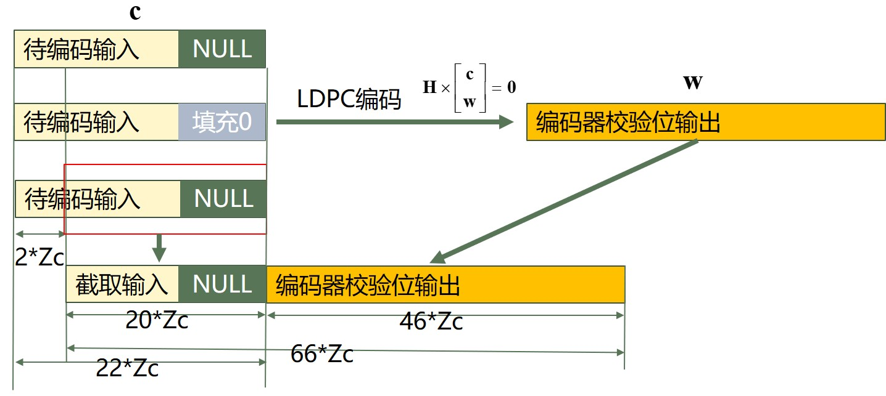

## 一、引言：5G 信道编码概述

在4G LTE中，Turbo编码作为核心信道编码方案，凭借其强大的纠错性能和实现成熟度，在多种传输场景中得到了广泛应用。

在5G中，**LDPC**（低密度奇偶校验码） 被引入作为数据信道的主要信道编码方式，取代了LTE中的Turbo码。

本节将系统介绍5G NR中LDPC编码流程，包括传**输块CRC附加**、**基图选择与段划分**、**码字生成**、**速率匹配及码块级联**等关键步骤。

## 二、5G下行信道编码流程总体介绍

5G NR 的下行共享信道（PDSCH）信道编码流程总体与4G系统类似，包括以下步骤：

- 传输块CRC附加：为每个传输块添加24比特的CRC，用于差错检测（见 38.212 - 7.2.1）；

- LDPC基图选择：根据传输块大小和调制方式选择LDPC基图（Base Graph 1 或 2），为后续编码提供结构依据（见 7.2.2）；

- 码块分段与子块CRC附加：当传输块过大时将其分段，并对每个码块附加CRC（见 7.2.3）；

- 信道编码：使用LDPC编码对每个码块进行独立编码，提升纠错能力（见 7.2.4）；

- 速率匹配：通过比特选择、交织和重复/裁剪等操作使输出比特数适应物理层资源分配（见 7.2.5）。

## 三、传输块级 CRC 添加（Transport Block CRC Attachment）

同4G，TB级CRC附加（Transport Block CRC Attachment）用于对每个**传输块**（Transport Block）提供**整体错误检测能力**，确保数据传输的完整性。

参考 [TS 38.212 第7.2.1节 和 第5.1节]

映射顺序采用最高有效位优先（MSB），即按大端序排列。

**选择规则如下：**

根据传输块长度 𝐴（比特），选择CRC多项式长度：

- 长块（A > 3824）： 使用24比特CRC，多项式为 CRC24A(D)

$$
g_{\text {CRC } 24 \mathrm{~A}}(D)=D^{24}+D^{23}+D^{18}+D^{17}+D^{14}+D^{11}+D^{10}+D^7+D^6+D^5+D^4+D^3+D+1
$$

- 短块（A ≤ 3824）： 使用16比特CRC，多项式为 CRC16(D)

$$
g_{\mathrm{CRC} 16}(D)=\left[D^{16}+D^{12}+D^5+1\right]
$$

**编码过程：**

- 输入比特序列:

$$
a_0, a_1, \ldots, a_{A-1}
$$

- 在有限域 GF(2) 上，按照系统形式进行CRC编码:
  - 输入序列与多项式整除，余数作为CRC附加至原始数据尾部

输出最终比特序列:

$$
b_0, b_1, \ldots, b_{B-1}
$$

其中：

$$
B = A + L
$$

L 位CRC长度。

**总之5G中TB级CRC附加机制与LTE几乎完全一致，本质上均为在GF(2)域进行多项式除法运算。**

## 四、LDPC基图的选择

参考TS 38.212 7.2.2

在5G NR中，LDPC信道编码使用**两种基础母矩阵**（Base Graph）结构，分别称为**基图1**和**基图2**。

为了在不同数据量和场景下实现性能与复杂度的权衡，5G标准根据**有效载荷大小A**（即传输比特长度）和**编码速率R**的组合来选择合适的基图：

基图的选择规则为：

$$
\text { 基图 }= \begin{cases}2, & \text { 当 } A \leq 292, \text { 或 }(A \leq 3824 \text { 且 } R \leq 0.67), \text { 或 } R \leq 0.25 \\ 1, & \text { 否则 }\end{cases}
$$

其中：

- A：原始传输块长度；
- R：编码速率
- 基图1和基图2对应不同结构和稀疏程度的校验矩阵

**性能与效率权衡**：

- **基图1**：适用于**高码率**、**大数据块**场景，编码效率高
- **基图2**：适用于**低码率**、**小数据块**或高可靠性需求场景

## 五、码块分割与子块CRC附加

参考 3GPP TS 38.212 5.2.2

码块分割与子块CRC附加”阶段的主要目标是将整个**传输块**（Transport Block）划分为多个**更小的码块**（Code Block）并为每个码块分别**添加CRC校验**。


### 1. 输入输出

- 输入：添加过TB CRC的完整比特流

$$
\left\{b_0, b_1, \ldots, b_{B-1}\right\}
$$

长度 B=A+24

- 输出：生成 𝐶 个码块

$$
\left\{c_{r, 0}, c_{r, 1}, \ldots, c_{r,\left(K_r-1\right)}\right\}
$$

每个码块附加24比特子块CRC校验。

### 2. 最大码块长度 Kcb 的确定

LDPC编码器根据所选的基图（Base Graph）决定码块最大长度 𝐾𝑐𝑏

- 基图1：最大码块长度为 8448；
- 基图2：最大码块长度为 3840；

根据 𝐾𝑐𝑏 的大小判断是否需要码块分割。若传输块长度 𝐵>𝐾𝑐𝑏 ，则进行分割；否则直接进入编码阶段。

### 3. 码块数量计算

**目前已知输入：**

- 已添加 TB CRC 的传输块比特流，长度为 B；
- 当前选定的最大码块长度 𝐾𝑐𝑏（由所选基图决定）；

📌 分两种情况处理：

**case1：单码块场景（不分段）**

$$
B \leq K_{c b}
$$

- 无需拆分，设置码块数量为 𝐶=1；
- **不再添加码块级 CRC**
- 输出总长度不变：𝐵′=𝐵；

**case1：多码块场景（需分段）**

$$
B>K_{c b}
$$

- 需将传输块拆分成**多个码块**，每个码块长度最多为 𝐾𝑐𝑏−𝐿，其中 𝐿=24 是每个码块附加的 CRC 长度；
- 码块数量计算为：

$$
C=\left\lceil\frac{B}{K_{c b}-L}\right\rceil
$$

- 每个码块附加 24 比特 CRC，总输出长度更新为：

$$
B^{\prime}=B+C \cdot L
$$

该步骤确保每个码块不会超过 LDPC 编码器的最大处理能力，并为每个独立的码块单独添加 CRC 校验

### 4. 提升因子与码块长度计算

参考 3GPP TS 38.212 5.2.2

在 5G LDPC 编码中，为了确定最终的码块长度及编码矩阵结构，还需引入**提升因子**（Lifting Size）𝑍𝑐 ，用于生成 LDPC 码的实际结构。

✅ 第一步：确定基图类型对应的最小提升因子下界 𝐾𝑏

- 基图 1 固定为：

$$
K_b=22
$$

- 基图 2 根据输入长度 𝐵 动态选择：

$$
K_b= \begin{cases}10, & B>640 \\ 9, & 560<B \leq 640 \\ 8, & 192<B \leq 560 \\ 6, & B \leq 192\end{cases}
$$

✅ 第二步：计算每个码块的目标编码长度（不含填充）

设总输出长度为 𝐵′，码块数量为 𝐶，则每个码块需编码的目标长度为：

$$
K^{\prime}=\left\lceil\frac{B^{\prime}}{C}\right\rceil
$$

✅ 第三步：从标准中选择合适的提升因子 𝑍𝑐

- 提升因子需满足：

$$
K_b \cdot Z_c \geq K^{\prime}
$$

- 从标准表（如 Table 5.3.2-1）中选择满足条件的**最小** 𝑍𝑐；
  


✅ 第四步：确定最终编码长度与填充位数

- 最终编码长度为：
  - 基图 1：𝐾=22𝑍𝑐
  - 基图 2：𝐾=10𝑍𝑐

- 若实际比特数小于编码矩阵大小，则需填充：

$$
F=K-K^{\prime}
$$

### 5. 码块分割及码块级CRC添加

- 将**大传输块**拆分为多个适合编码的**码块**；
- **为每个码块添加 CRC 校验位**，提供单独的错误检测能力；
- **填充空白比特位**（Filler Bits），确保码块长度与 LDPC 校验矩阵匹配。

#### (a) 前置条件

- 传输块 TB 已经添加了 TB 级 CRC；
- TB 被分割为 𝐶 个码块；
- 每个码块后续将分别输入 LDPC 编码器。

| 操作             | 内容说明                                          |
| -------------- | --------------------------------------------- |
| **数据分配**       | 将 CRC 后的比特流均匀划分为 C 个码块                      |
| **码块级 CRC 添加** | 若 C > 1，则为每个码块添加 24 位 CRC                   |
| **长度对齐**       | 对不足 LDPC 编码长度的码块添加填充位（Filler Bits），通常填“0”且不发送 |

#### (b) 关键参数梳理

- 输入比特流：原始比特流：

$$
b_0, b_1, \ldots, b_{B^{\prime}-1}
$$

其中 $$B'=B+C\cdot L$$,为添加子块CRC与填充后的总长度；

- 码块数量：𝐶
- 码块长度（不含填充）：𝐾′
- CRC长度：24

#### (c) 具体步骤说明

- 初始化：设置比特计数指针 𝑠=0，用于在原始比特流中按顺序输入数据。

- 循环写入比特流到各码块：

- 添加CRC校验位（当 𝐶>1 时）

- 填充空位（Filler Bits）:对于 𝑘=𝐾′ 到 𝐾−1，将比特填充为 NULL。

✅ **最终输出**

- 𝐶 个码块，每个码块长度均为 𝐾，包含原始数据、CRC及填充位；
- 输出比特流供下一步 LDPC 编码使用:

$$
c_{r, 0}, c_{r, 1}, \ldots, c_{r, K-1}
$$

#### (d) 示例验证

以下代码完整地实现了 5G NR 下 LDPC 信道编码流程中的码块分割与子块 CRC 添加，并与 MATLAB 内置函数进行了对比：

**传输块生成与传输块级 CRC 添加**

```matlab
A = 34407;                   % 原始传输块大小
trBlk = randi([0 1],A,1);    % 生成随机传输块数据
R = 1/3;                     % 编码率设置

% 选择 CRC 类型（16位或24位）
if A > 3824
    L = 24; TB_CRC_type = '24A';
else
    L = 16; TB_CRC_type = '16';
end

crced = nrCRCEncode(trBlk, TB_CRC_type);  % 添加 CRC
```

**基图选择（Base Graph Selection）**

```matlan
if A <= 292 || (A <= 3824 && R <= 0.67) || R <= 0.25
    bgn = 2;
else
    bgn = 1;
end
```

码块分割与子块 CRC 添加（自定义函数）

```matlab
c_blocks = codeBlockSegmentationAndCRC(crced, bgn);
```

以下函数完成：

- 判断是否需要分块；
- 计算码块数量 C；
- 子块 CRC（CRC24B）添加（当 C > 1）；
- 根据基图确定 Kb 与 Zc，最终确定 K；
- 将原始数据填入每个码块中；
- 用 -1 填充空位，标记 NULL。

```matlab
function c_blocks = codeBlockSegmentationAndCRC(b, baseGraph)
% 5G LDPC: 码块分割及子块CRC添加
% 输入：
%   b           : 原始传输块比特流（0/1数组）
%   baseGraph   : LDPC基图编号（1或2）
% 输出：
%   c_blocks    : C×K 矩阵，每行为一个码块（包含数据、CRC和填充）
% ----------------- 参数设置 -----------------
L_crc = 24;  % CRC24B 长度
B = length(b);  % 原始比特数

% 最大码块长度 K_cb
if baseGraph == 1
    K_cb = 8448;
elseif baseGraph == 2
    K_cb = 3840;
else
    error('Invalid baseGraph. Use 1 or 2.');
end

% ----------------- 判断是否需要分块 -----------------
if B <= K_cb
    C = 1;
    L = 0;
else
    C = ceil(B / (K_cb - L_crc));
    L = L_crc;
end

% 总比特长度（包含子块CRC）
B_prime = B + C * L;

% 码块长度（不含填充）
K_prime = ceil(B_prime / C);

if baseGraph == 1
    Kb = 22;
else
    if B > 640
        Kb = 10;
    elseif B > 560
        Kb = 9;
    elseif B > 192
        Kb = 8;
    else
        Kb = 6;
    end
end

Zlist = [2:16 18:2:32 36:4:64 72:8:128 144:16:256 288:32:384];
Zc =  min(Zlist(Kb*Zlist >= K_prime));


if baseGraph == 1
    K = 22*Zc;
else
    K = 10*Zc;
end


% ----------------- 数据写入各码块 -----------------
c_blocks = nan(K, C);  % 用NaN标记填充值
s = 1;

for r = 1:C
    for k = 1:(K_prime - L)
        if s <= length(b)
            c_blocks(k, r) = b(s);
            s = s + 1;
        else
            c_blocks(k, r) = 0;  % 不足补0
        end
    end

    % ----------------- 添加CRC（当 C > 1） -----------------
    if C > 1
        msg = c_blocks(1:(K_prime - L), r);
        msg_crc = nrCRCEncode(msg,"24B");
        c_blocks(1:K_prime, r) = msg_crc;
    end

    % ----------------- 填充位 NULL -----------------
    if K_prime < K
        c_blocks((K_prime + 1):K, r) = -1;  % 标记为 NULL
    end
end
end
```

## 六、5G LDPC 编码

### 1. 输入输出

在完成前一阶段的**码块分割及码块级CRC添加**之后：

- 原始传输块被分割为 𝐶 个码块（Code Block）
- 每个码块的输入比特流记为：

$$
c_{r, 0}, c_{r, 1}, \ldots, c_{r, K_r-1}
$$

其中 𝑟 为码块索引（第 𝑟 个码块），Kr 为第 r 个码块的比特数

输入维度：

| 基图编号 | 输入长度 $$K$$           |
| ---- | ------------------ |
| BG1  | $$K = 22 \cdot Z_c$$ |
| BG2  | $$K = 10 \cdot Z_c$$ |


- 每个码块单独进行 LDPC 编码(依照 3GPP TS 38.212 §5.3.2 进行)
- 每个码块的编码输出为：
  
$$
d_{r, 0}, d_{r, 1}, \ldots, d_{r, N_r-1}
$$
  
即第 𝑟 个码块的编码比特序列，长度为 𝑁𝑟。

编码输出比特长度由 **基图类型** 和 **提升值** 𝑍𝑐共同决定：

| 基图编号 | 码字长度 $$N$$     |
| ---- | ------------ |
| 基图 1 | $$N = 66 Z_c$$ |
| 基图 2 | $$N = 50 Z_c$$ |

### 2. 编码前数据准备

依据 TS 38.212 第 5.3.2 节

编码器的输入为维度为 [𝐾,𝐶] 的比特矩阵，其中每列为一个码块。由于之前的码块填充处理可能存在“**无效比特”（-1 填充值）**，标准规定：

在 LDPC 编码前，**填充值必须被替换为全 0**。

**替换逻辑**：

- 如果比特为 <NULL>，则在编码输入中置为 0；
- 否则保留原始有效值。

即：

$$
c_k= \begin{cases}0, & \text { if } c_k=<\mathrm{NULL}> \\ c_k, & \text { otherwise }\end{cases}
$$

至此，**送入 LDPC 编码器的所有信息比特准备完成**，每列为一个独立码块的编码输入，即将进入 LDPC 编码阶段。

### 3. LDPC 编码

TS 38.212 5.3.2

#### (a) 编码输入结构

编码器的输入比特流为**每个码块**比特：

$$
\mathbf{c}=\left[c_0, c_1, \ldots, c_{K-1}\right]^T
$$

K：取决于基图（BG1 为 22𝑍𝑐，BG2 为 10𝑍𝑐）

LDPC 编码器的任务是基于输入 **𝑐** 生成校验比特 **𝑤**，使得整个码字满足奇偶校验关系：

$$
\mathbf{x}=\left[\begin{array}{l}
\mathbf{c} \\
\mathbf{w}
\end{array}\right] \quad \text { 使得 } \quad H \cdot \mathbf{x}=\mathbf{0}
$$

其中：

- 𝐻：为 LDPC 的校验矩阵（取决于基图）
- 𝑤
- w：为 𝑁−𝐾 个校验比特，维度 (𝑁−𝐾)×1
- N：LDPC 编码块长度（BG1 为 66𝑍𝑐，BG2 为 50𝑍𝑐）

LDPC 编码是一个线性方程求解问题，在有限域 GF(2) 中进行。

#### (b) 基图矩阵的构造与获取

🧩 什么是基图矩阵 $$H_{BG}$$

LDPC 编码器的核心依赖一个**稀疏的校验矩阵** 𝐻。此矩阵不是直接使用完整矩阵表示，而是通过 **基图矩阵**（Base Graph） 与 **提升因子** 𝑍𝑐 组合生成。

两个维度：

| 类型       | 矩阵维度           |
| -------- | -------------- |
| **基图 1** | $$46 \times 68$$ |
| **基图 2** | $$42 \times 52$$ |


基图元素由标准表格定义，参见 3GPP TS 38.212 中：


- 表 5.3.2-2：BG1
- 表 5.3.2-3：BG2

**元素含义如下：**

- 若 $$V_{i, j}=v$$，表示在位置 (𝑖,𝑗) 处放置一个 向右移位 𝑣 的单位循环矩阵 $$I_v$$
- 若为空值，表示该位置没有值（即为零矩阵）

#### (c) 实际编码矩阵 𝐻 生成规则

通过**提升因子**扩展基图矩阵，得到 LDPC 编码器使用的实际稀疏校验矩阵 𝐻，其维度满足编码所需。

完整的 LDPC 校验矩阵通过如下方式构建：

$$
H=\left[V_{i, j}\right]_{m \times n} \otimes I_{Z_c}
$$

其中：

- m,n 是基图维度（例如 BG1 为 46×68）
- $$I_{Z_c}$$ 为 𝑍𝑐×𝑍𝑐的单位循环移位矩阵

从另一个角度看，**构造规则**如下：

每个基图矩阵元素 𝑉𝑖,𝑗 被替换为一个 𝑍𝑐×𝑍𝑐 的子矩阵：

| $$V_{i,j}$$ 类型 | 替换矩阵类型     | 含义                                 |
| ------------ | ---------- | ---------------------------------- |
| 空值      | 全零矩阵       | 用 $$Z_c \times Z_c$$ 的全 0 矩阵替代       |
| 0            | 单位矩阵       | 替换为 $$Z_c \times Z_c$$ 单位矩阵          |
| $v>0$        | **循环置换矩阵** | 替换为单位矩阵右移 $$v$$ 位得到的循环置换矩阵 $$P_{i,j}$$ |

循环置换矩阵定义为将单位矩阵 I 循环右移 Pi,j​ 次：

$$
P_{i, j}=\bmod \left(V_{i, j}, Z_c\right)
$$

例如对于一个三维矩阵，若 $$P_{i, j}=2$$，则循环置换矩阵为：

$$
\left[\begin{array}{lll}
0 & 0 & 1 \\
1 & 0 & 0 \\
0 & 1 & 0
\end{array}\right]
$$

即将单位矩阵每一行循环右移 2 位。

扩展后编码矩阵H维度：

| 基图类型 | 基图维度           | 扩展后编码矩阵维度（乘 $$Z_c$$）       |
| ---- | -------------- | -------------------- |
| BG1  | $$46 \times 68$$ | $$46Z_c \times 68Z_c$$ |
| BG2  | $$42 \times 52$$ | $$42Z_c \times 52Z_c$$ |

#### (d) 送入编码器前关键参数总结

| 参数名称                    | 含义                         | 计算方式                                                                                                   |
| ----------------------- | -------------------------- | ------------------------------------------------------------------------------------------------------ |
| **奇偶校验矩阵** $$\mathbf{H}$$ | 编码使用的稀疏矩阵，维度为 $$m \times n$$ | 通过基图矩阵 $$H_{BG}$$ 扩展得到，依赖提升因子 $$Z_c$$                                                                      |
| **码字总长度** $$n$$           | 编码输出比特数                    | $$n = \text{BlockLength} = N = \text{列数} \times Z_c$$<br>BG1: $$68 \times Z_c$$<br>BG2: $$52 \times Z_c$$    |
| **校验位数** $$m$$            | 奇偶校验比特数量                   | $$m = \text{NumParityCheckBits} = \text{行数} \times Z_c$$<br>BG1: $$46 \times Z_c$$<br>BG2: $$42 \times Z_c$$ |
| **信息位数** $$k$$            | 原始输入比特数（含 CRC、填充）          | $$k = n - m$$<br>BG1: $$22 \times Z_c$$<br>BG2: $$10 \times Z_c$$                                            |
| **编码码率** $$R$$            | 有效信息与编码输出的比值               | $$R = \frac{k}{n}$$                                                                                     |

**示例计算**：

假设：

- 提升因子 𝑍𝑐=192
- 基图选择：BG1（BaseGraph 1）

| 参数项      | 数值                                  |
| -------- | ----------------------------------- |
| 校验矩阵维度   | $$46 \times 68$$ × 192 = 8832 × 13056 |
| 校验位数 $$m$$ | $$46 \times 192 = 8832$$              |
| 总码长 $$n$$  | $$68 \times 192 = 13056$$             |
| 信息位数 $$k$$ | $$22 \times 192 = 4224$$              |
| 编码码率 $$R$$ | $$\frac{4224}{13056} \approx 0.3235$$ |

#### (e) 编码矩阵结构解析与编码方程建立

在 LDPC 编码中，需满足如下同余条件（GF(2)域）：

$$
\mathbf{H} \cdot\left[\begin{array}{c}
\mathbf{c} \\
\mathbf{w}
\end{array}\right]=0
$$

其中：

- **c**：待编码的信息比特；
- **w**：要生成的校验比特；
- **H**:编码矩阵（由基图 H_BG 扩展生成的稀疏大矩阵）


解稀疏矩阵H和解基图矩阵类似，此处为了方便说明此处以HBG代替H，**省略Zc**，其中每个元素都是一个 ZcxZc 维度矩阵。

H_BG 矩阵被划分为如下 6 个子矩阵：

$$
H_{B G}=\left[\begin{array}{cc|cc}
A & B & \mathbf{0} & \mathbf{0} \\
C_1 & C_2 & P_b^T & I
\end{array}\right]
$$

编码的目标是通过求解：

$$
P_b \quad P_c
$$

使整体满足方程：

$$
H_{B G}\left[\begin{array}{l}
S^T \\
P_b^T \\
P_c^T
\end{array}\right]=0
$$

即：

$$
\left[\begin{array}{ccc}
A & B & 0 \\
C_1 & C_2 & I
\end{array}\right]\left[\begin{array}{l}
S^T \\
P_b^T \\
P_c^T
\end{array}\right]=0
$$

即：

$$
\begin{aligned}
& A S^T+B P_b^T=0^T \\
& C_1 S^T+C_2 P_b^T+P_c^T=0
\end{aligned}
$$

其中：

$$
A=\left[\begin{array}{cccc}
a_{1,1} & a_{1,2} & \ldots & a_{1, K} \\
a_{2,1} & a_{2,2} & \ldots & a_{2, K} \\
a_{3,1} & a_{3,2} & \ldots & a_{3, K} \\
a_{4,1} & a_{4,2} & \ldots & a_{4, K}
\end{array}\right]
$$

$$
C_1=\left[\begin{array}{cccc}
c_{1,1} & c_{1,2} & \ldots & c_{1, K} \\
c_{2,1} & c_{2,2} & \ldots & c_{2, K} \\
\vdots & \vdots & \ddots & \\
c_{M-4,1} & c_{M-4,2} & \ldots & c_{M-4, K}
\end{array}\right]
$$

$$
C_2=\left[\begin{array}{cccc}
c_{1, K+1} & c_{1, K+2} & c_{1, K+3} & c_{1, K+4} \\
c_{2, K+1} & c_{2, K+2} & c_{2, K+3} & c_{2, K+4} \\
\vdots & \vdots & \ddots & \\
c_{M-4, K+1} & c_{M-4, K+2} & c_{M-4, K+3} & c_{M-4, K+4}
\end{array}\right]
$$

对于子矩阵 B，总结只有四种情况（BG1有两种，BG2有两种），此处给出BG2的情况：

$$
H_{B G 2_{-} B 1}=\left[\begin{array}{cccc}
0 & 0 & -1 & -1 \\
-1 & 0 & 0 & -1 \\
1 & -1 & 0 & 0 \\
0 & -1 & -1 & 0
\end{array}\right]
$$

$$
H_{B G 2_{-} B 2}=\left[\begin{array}{cccc}
1 & 0 & -1 & -1 \\
-1 & 0 & 0 & -1 \\
0 & -1 & 0 & 0 \\
1 & -1 & -1 & 0
\end{array}\right]
$$

**现在重新整理：**

目的是求解：

$$
\begin{aligned}
& A S^T+B P_b^T=0^T \\
& C_1 S^T+C_2 P_b^T+P_c^T=0
\end{aligned}
$$

- 首先求解：

$$
A S^T+B P_b^T=0^T 
$$

- 已知A；

$$
A=\left[\begin{array}{cccc}
a_{1,1} & a_{1,2} & \ldots & a_{1, K} \\
a_{2,1} & a_{2,2} & \ldots & a_{2, K} \\
a_{3,1} & a_{3,2} & \ldots & a_{3, K} \\
a_{4,1} & a_{4,2} & \ldots & a_{4, K}
\end{array}\right]
$$

当：

$$
B=H_{B G 2 \_B 1}=\left[\begin{array}{cccc}
0 & 0 & -1 & -1 \\
-1 & 0 & 0 & -1 \\
1 & -1 & 0 & 0 \\
0 & -1 & -1 & 0
\end{array}\right]
$$

- 0表示取原矩阵
- 1表示对单位阵循环右移
- -1表示取 0 矩阵

转换为求解如下方程：

$$
\left\{\begin{array}{l}
\sum_{j=1}^K a_{1, j} s_j+p_{b_1}+p_{b_2}=0 \\
\sum_{j=1}^K a_{2, j} s_j+p_{b_2}+p_{b_3}=0 \\
\sum_{j=1}^K a_{3, j} s_j+p_{b_1}^{(1)}+p_{b_3}+p_{b_4}=0 \\
\sum_{j=1}^K a_{4, j} s_j+p_{b_1}+p_{b_4}=0
\end{array}\right.
$$

此处不妨令：

$$
\lambda_i=\sum_{j=1}^K a_{i, j} s_j \quad i=1,2,3,4
$$

所有矩阵都遵循异或加法，四式相加后易得：

$$
\left\{\begin{array}{l}
p_{b_1}^{(1)}=\sum_{i=1}^4 \lambda_i \\
p_{b_2}=\lambda_1+p_{b_1} \\
p_{b_3}=\lambda_2+p_{b_2} \\
p_{b_4}=\lambda_4+p_{b_1}
\end{array}\right.
$$

其它BG情况和B的情况同理。

求解出Pb后，可根据下公式求解Pc：

$$
C_1 S^T+C_2 P_b^T+P_c^T=0
$$

即：

$$
P_{c i}=\sum_{j=1}^K c_{i, j} s_j+\sum_{j=1}^4 c_{i,(K+j)} p_{b j}
$$

**总结整个编码过程：**

本质是求解：

$$
\left[\begin{array}{ccc}
A & B & 0 \\
C_1 & C_2 & I
\end{array}\right]\left[\begin{array}{l}
S^T \\
P_b^T \\
P_c^T
\end{array}\right]=0
$$

以 BG2 的$$B=\left[\begin{array}{cccc}
0 & 0 & -1 & -1 \\
-1 & 0 & 0 & -1 \\
1 & -1 & 0 & 0 \\
0 & -1 & -1 & 0
\end{array}\right]$$为例：

可以求出校验位：

$$
\left\{\begin{array}{l}
p_{b_1}^{(1)}=\sum_{i=1}^4 \lambda_i \\
p_{b_2}=\lambda_1+p_{b_1} \\
p_{b_3}=\lambda_2+p_{b_2} \\
p_{b_4}=\lambda_4+p_{b_1}
\end{array} \quad P_{c i}=\sum_{j=1}^K c_{i, j} s_j+\sum_{j=1}^4 c_{i,(K+j)} p_{b j}\right.
$$

其中 $$\lambda_i=\sum_{j=1}^K a_{i, j} s_j \quad i=1,2,3,4$$

由此编码过程完成。即协议中的**ｗ**求出。

### 4. 编码输出构成与截取

TS 38.212 §5.3.2.2

将编码器输出的 **奇偶校验位** 𝑤 与**原始信息比特序列** 𝑐 组合，生成最终的编码输出比特序列 𝑑

- 跳过前 2Zc 位信息比特并拼接奇偶校验位

信息比特：

$$
\mathbf{c}=\left[c_0, c_1, \ldots, c_{K-1}\right]
$$

奇偶校验比特：

$$
\mathbf{w}=\left[w_0, w_1, \ldots, w_{N-K-1}\right]
$$

拼接在 𝑐 后得到**最终输出序列**：

$$
d=[\underbrace{c_{2 Z_c}, c_{2 Z_c+1}, \ldots, c_{K-1}}_{\text {原始数据, 跳 过前 } 2 Z_c \text { 位 }}, \underbrace{w_0, w_1, \ldots, w_{N+2 Z-K-1}}_{\text {校验位 }}]
$$

- 填充值（Filler Bits）还原

✅ **在构成最终编码输出比特序列 d 时，原来信息比特中是 NULL（-1）的地方，需要将这些位置还原为 NULL（编码时置为0）**

经过此步骤，最终完成 LDPC 编码器中 “数据输出”构成的封装流程。

### 5. LDPC编码小结

下图给出LDPC编码模块的数据维度变化情况：


下图以BG1为例，给出一个码块数据编码全过程：



## 七、速率匹配

3GPP TS 38.212 第 7.2.5 节

速率匹配主要由以下两个过程构成：

- 比特选择（Bit Selection）
- 比特交织（Bit Interleaving）

其作用：

根据无线信道资源调整编码后的**比特长度**，使其精确匹配**调制器**所需的比特数量。

### 1. 输入输出：

- 输入：

编码后的码块比特序列：

$$
d_{r, 0}, d_{r, 1}, \ldots, d_{r, N_r-1}
$$

其中 𝑟 为第 𝑟 个码块，𝑁𝑟 为该码块的编码输出比特数。

- 输出：

速率匹配后的比特序列：

$$
f_{r, 0}, f_{r, 1}, \ldots, f_{r, E_r-1}
$$

其中 𝐸𝑟 是速率匹配输出的目标比特数

### 2. 比特选择（Bit Selection）

核心功能：从 LDPC 编码输出中选出恰好 𝐸𝑟 个比特，用于后续调制映射，匹配无线物理资源配置。

- 循环缓冲区（Circular Buffer）：
  - LDPC 编码输出将被顺序写入一个长度为 𝑁𝑐𝑏 的循环缓冲区。
  - 对 DLSCH 场景来说，𝑁𝑐𝑏=𝑁，即完整的码字长度。
  - 缓冲区会按 **冗余版本** RV 不同，从不同位置开始读取，具体参见协议表5.4.2.1-2。
  - 比特选择过程中需跳过所有 NULL（即原始填充位）比特。
  
- 目标输出比特数
  - 指每个码块速率匹配后需要提取的比特数量
  - 计算方式与调制方式、传输层参数等相关

### 3. 比特交织（Bit Selection）

- 通过打乱比特顺序，避免连续比特受同一突发干扰破坏；

- 有效提升纠错性能。

**输入输出：**

输入：比特选择输出序列

$$
e_0, e_1, \ldots, e_{E_r-1}
$$

输出：交织后比特序列

$$
f_0, f_1, \ldots, f_{E_r-1}
$$

**交织操作（横进竖出）：**

- 将输入序列以行优先方式填入$$\frac{E_r}{Q_m} \times Q_m$$维度的矩阵中
- 按列优先顺序输出比特。

### 4. 速率匹配小结

- **比特选择**确保从编码结果中**抽取所需比特数**，**跳过填充值**，并可通过起始位置实现**RV的多版本支持**；
- **比特交织**则为进一步增强传输可靠性提供支持

二者共同完成了对原始LDPC编码比特的处理，**为调制映射做好了准备**。

## 八、码块级联

- 将前面经过 LDPC 编码 → 速率匹配 的多个码块（Code Blocks）**合并**
- 拼接形成一个**完整的传输块**（Transport Block）
- 输出最终送往**物理层调制**的完整比特序列

**拼接过程：**

输入：

- 来自速率匹配模块的各码块比特序列：

$$
\left\{f_{r, 0}, f_{r, 1}, \ldots, f_{r, E_r-1}\right\}, \quad r=0,1, \ldots, C-1
$$

输出：

传输块总比特序列：

$$
g_0, g_1, \ldots, g_{G-1}
$$

其中：

$$
G=\sum_{r=0}^{C-1} E_r
$$

即为所有码块速率匹配后的比特数之和。

📋 规则：

- 不涉及任何复杂变换，仅将各码块的比特按照顺序拼接输出；

**至此整个 5G NR 的 DLSCH 信道编码过程完成**

## 九、LDPC 编码过程总结

5G NR 的 DLSCH 信道编码过程包括多个有序步骤，依次对原始数据进行传**输块级 CRC 添加、码块分割与子块 CRC 添加、填充处理与 LDPC 编码、速率匹配以及码块级联**。

逐步将原始数据转化为适配物理信道传输的编码比特流，是实现 5G 高速可靠通信的核心流程。